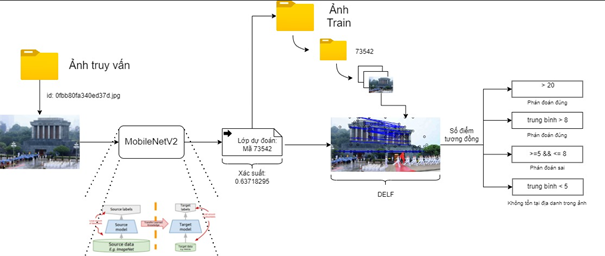

# Nghiên cứu xây dựng ứng dụng ChatGPT kết hợp deep learning trong việc hỗ trợ khách du lịch tìm hiểu thông tin qua ảnh
Du lịch là một trong những thế mạnh của Việt Nam, bởi nước chúng ta có rất nhiều địa điểm du lịch đặc sắc. Tuy nhiên, cũng có các khó khăn nhất định khi khách du lịch trong nước và đặc biệt là du khách nước ngoài tới thăm các địa điểm danh lam thắng cảnh mà chưa biết được thông tin về địa danh này trước đó. Từ khó khăn này chúng tôi nghiên cứu và xây dựng tính năng trợ giúp cho khách du lịch giải quyết vấn đề này, nhằm nâng cao trải nghiệm cũng như tạo hứng thú cho họ. Nghiên cứu này tiến hành nghiên và cứu xây dựng mô hình giải quyết bài toán dựa trên các mô hình học sâu (Deep Learning) và sử dụng dữ liệu tự xây dựng từ các địa danh nổi tiếng trong nước kết hợp với bộ dữ liệu Google Landmarks v2. Ngoài ra, dự án cũng xây dựng một sản phẩm hoàn chỉnh bao gồm các module nhỏ kết hợp cùng với chatbox ChatGPT. Đây là một nghiên cứu có tính thực tiễn và có thể áp dụng vào thực tế hiện nay.

## Kiến trúc hệ thống
